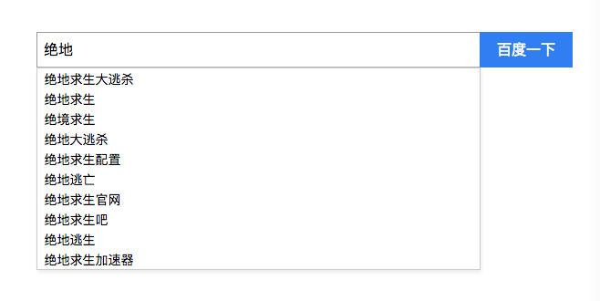

# searchBar
## 模仿百度搜索框</br>
小组件通过jsonp获取百度数据动态添加到虚拟DOM中
效果：
## [在线尝试](http://bycrazystone.com/searchBar)
### 文档结构
结构很简单：
```html
<div class="div">
    <form class="form" autocomplete="off" onsubmit="return sub(this)">
        <input type="text" name="t" class="text"/>
        <input type="submit" value="百度一下" class="submit"/>
        <ul class="ul"></ul>
    </form>
</div>
```
### 主要function
```javascript
//绑定input框输入事件
function onInput(e) {
    var v = e.target.value.trim()
    if (v !== '') {
        //动态jsonp获取数据
        var a = document.createElement('script');
        a.src = 'http://www.baidu.com/su?&wd=' + encodeURI(v) + '&p=3&cb=fcb';
        document.body.appendChild(a);
    }
}
//回调函数
function fcb(data) {
    var newUl = document.createElement("ul");
    var oddUl = document.getElementsByTagName("ul")[0];
    if (data) {
        data.s.forEach(function (val) {
            var li = document.createElement("li");
            li.textContent = val;
            newUl.appendChild(li);
        })
        newUl.className = 'ul';
        newUl.style.display = 'block';
        EventUtil.addHandle(newUl, 'click', function (event) {
            var e = event || window.event;
            var target = e.target || e.srcElement;
            if (target.tagName.toLowerCase() == 'li') {
                var text = target.innerHTML || target.innerText;
                window.open('https://www.baidu.com/s?word=' + text);
                document.getElementsByClassName('text')[0].value = '';
                newUl.style.display = 'none';
            }
        })
        document.getElementsByClassName("form")[0].replaceChild(newUl, oddUl);
        oddUl = null;//gc垃圾回收
    }
    //删除script标签
    var s = document.body.querySelectorAll('script');
    for (var i = 1, len = s.length; i < len; i++) {
        document.body.removeChild(s[i]);
    }
}
```
